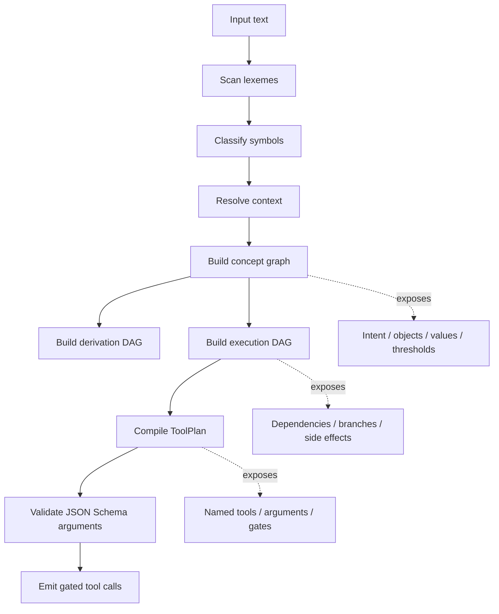
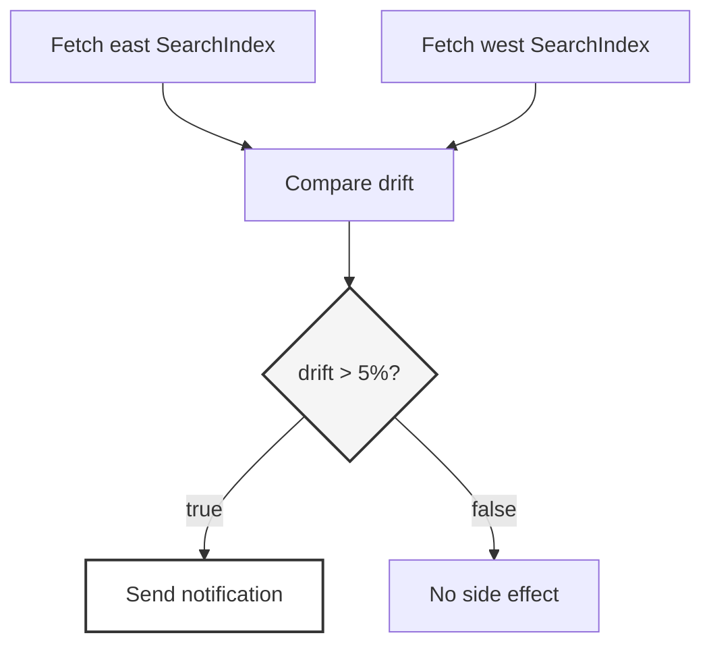
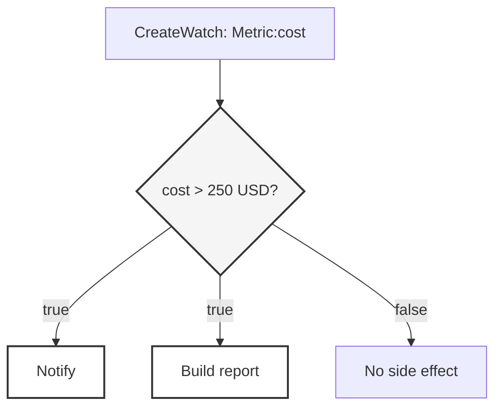

# blackstem-js

A symbolic compiler for executable tool plans.

`blackstem-js` is a small experiment in moving tool calling out of the model’s hidden behavior and into an inspectable compiler pipeline.

It does not train a model to emit JSON.

It compiles language into a plan.

```txt
language in
tool plan out
```

The claim is narrow:

A meaningful portion of tool calling does not need to be learned.

It can be scanned, classified, bound, validated, gated, and compiled.

## Why this exists

The current tool-calling story leans heavily on trained and fine-tuned models.

That approach can work.

It is also a strange default.

A trained tool-calling model learns a behavior distribution. It may call the right function most of the time. It may produce convincing JSON. It may even run locally.

But a tool call is not just text.

A tool call crosses from language into action.

At that boundary, the important questions are not poetic:

```txt
What action is being requested?
What object is being acted on?
What condition controls the action?
What schema must the arguments satisfy?
What depends on what?
What is allowed to cause a side effect?
What can be inspected before execution?
```

Those are compiler questions.

## What blackstem does

`blackstem-js` takes a request and builds a visible intermediate structure before it emits tool calls.



The output is not a single guessed function call.

The output is a plan.

That plan can contain named tools, JSON Schema arguments, dependencies, gates, thresholds, source objects, target objects, and downstream side effects.

## Example: reminder with temporal normalization

Input:

```txt
Remind me to check the boiler tomorrow morning.
```

The prototype recognizes a reminder intent, a monitored object, and temporal constraints:

```txt
intent:
  CreateReminder

object:
  PhysicalSystem:boiler

temporal:
  RelativeDate:tomorrow
  TimeBucket:morning
```

Compiled shape:

```txt
NormalizeTemporalConstraint
  temporal:
    - RelativeDate:tomorrow
    - TimeBucket:morning

CreateReminder
  text: check boiler
  temporal: $NormalizeTemporalConstraint.output
```

Tool calls:

```json
[
  {
    "name": "time_normalize",
    "arguments": {
      "temporal": ["RelativeDate:tomorrow", "TimeBucket:morning"],
      "cadence": []
    },
    "schemaValid": true
  },
  {
    "name": "calendar_create_reminder",
    "arguments": {
      "text": "check boiler",
      "temporal": "$NormalizeTemporalConstraint.output"
    },
    "dependsOn": ["time_normalize"],
    "schemaValid": true
  }
]
```

The important part is not that it made a reminder.

The important part is that temporal interpretation is separated from reminder creation.

## Example: compare, gate, notify

Input:

```txt
Compare the east and west search indexes and alert me if drift exceeds 5%.
```

The request is not one function call.

It is a graph.



Compiled shape:

```txt
FetchSubjectA
  subject: SearchIndex
  qualifier: Region:east

FetchSubjectB
  subject: SearchIndex
  qualifier: Region:west

Compare
  metric: Metric:drift

EvaluateCondition
  Metric:drift > 5%

Notify
  gatedBy: EvaluateCondition
```

Tool calls include an explicit gate:

```json
{
  "type": "gate_tool_call",
  "name": "condition_evaluate",
  "arguments": {
    "input": "$Compare.output",
    "thresholds": [
      {
        "metric": "Metric:drift",
        "operator": ">",
        "value": 0.05,
        "unit": "percent"
      }
    ]
  },
  "dependsOn": ["Compare"],
  "schemaValid": true
}
```

The notification is downstream of that gate:

```json
{
  "name": "notification_send",
  "dependsOn": ["condition_evaluate"],
  "gatedBy": ["condition_evaluate"],
  "schemaValid": true
}
```

That is the point.

Tool calling is not just choosing a function.

Tool calling is preserving the shape of the action.

## Example: watch with cadence and condition

Input:

```txt
Monitor index latency daily and notify me when it exceeds 10%.
```

Compiled shape:

```txt
CreateWatch
  target:
    - SearchIndex
    - Metric:latency
  cadence:
    - Daily

EvaluateCondition
  Metric:latency > 10%

Notify
  gatedBy: EvaluateCondition
```

This shows the useful middle ground.

The compiler does not need to understand the whole world.

It only needs to preserve the operational structure:

```txt
watch something
on a cadence
evaluate a threshold
then conditionally perform a side effect
```

That structure should not be trapped inside model weights.

## Example: one condition, multiple side effects

Input:

```txt
If cost is over $250, notify me and build a report.
```

Compiled shape:



This matters because one condition can branch into multiple downstream actions.

The current prototype gets the dependency shape right:

```txt
CreateWatch
  -> EvaluateCondition
    -> Notify
    -> BuildDocument
```

It also exposes a weakness.

`BuildDocument` currently depends on the condition, but is not explicitly marked with `gatedBy`.

That should change.

Dependency order is not permission.

Rule:

```txt
If an action depends on a condition, and that action causes a side effect,
it should carry the gate lineage explicitly.
```

## Why not just train a tiny model?

A trained or fine-tuned tool-calling model has structural weaknesses.

### Behavior is buried in weights

When a model calls the wrong tool, omits an argument, invents a field, or chooses the wrong interpretation, the failure is not sitting in a grammar rule.

It is smeared across parameters.

That makes it harder to inspect, patch, diff, review, and govern.

### Every new tool surface becomes a data problem

Add a tool.

Rename a parameter.

Change a schema.

Add a condition.

Split one tool into two.

Introduce a policy gate.

Now the model needs examples.

Not rules.

Examples.

That is backwards when the tool contract is already explicit.

### Fine-tuning creates competence, not guarantees

Fine-tuning can improve behavior inside a known distribution.

It does not make the model a compiler.

It does not prove that required fields are present.

It does not prove that a condition was preserved.

It does not prove that a dangerous action was gated.

It does not prove that the plan shape is valid.

You still need validation around it.

At that point, the obvious question is:

```txt
Why is the model in the control path?
```

### Flat function calls are too small

Real tool use is often not one call.

It is a plan.

```txt
fetch this
compare that
check a threshold
branch on the result
notify only if the condition passes
build a report only after the gate
```

A single emitted function call is too small an artifact.

`blackstem-js` treats the plan as the artifact.

### Regression is quiet

A trained model can improve on a benchmark while getting worse on a workflow you care about.

That is the nightmare shape:

```txt
high aggregate score
low local trust
```

For tool calling, local trust matters more.

## What the trace exposes

The trace is not debug noise.

The trace is the product.

A reviewer can inspect:

```txt
what symbols were recognized
what intent was inferred
what objects were bound
what thresholds were extracted
what dependencies were created
what gates were applied
what schema validation passed
where ambiguity remained
```

That is a different trust model from a model emitting plausible JSON.

## Known weaknesses

This is a prototype.

The rough edges are visible.

That is the advantage.

### 1. The weather path currently cheats

Input:

```txt
What is the weather in Boston?
```

The concept graph currently marks `weather` and `Boston` as unknown symbols.

But the tool-plan compiler still emits:

```json
{
  "name": "get_weather",
  "arguments": {
    "units": "fahrenheit",
    "city": "Boston",
    "state": "MA"
  },
  "schemaValid": true
}
```

That proves there are currently two paths:

```txt
symbolic graph path
direct tool-plan override path
```

Those should converge.

The compiler should understand `weather` and `Boston` symbolically, not route around its own graph.

### 2. “Every morning” loses cadence

Input:

```txt
Every morning, check the primary API latency and alert me above 2.5%.
```

The symbol layer sees:

```txt
Every -> Determiner:every
morning -> TimeBucket:morning
```

But the execution layer emits:

```json
"cadence": ["Repeated"]
```

instead of:

```json
"cadence": ["Every(TimeBucket:morning)"]
```

That is a bug.

It is also a useful bug.

It is visible, local, and fixable.

### 3. Qualifier binding is crude

In the primary API latency example, `primary` should bind to `API`.

The intended structure is:

```txt
System:api(Role:primary)
Metric:latency
```

not:

```txt
Metric:latency(Role:primary)
```

This is a symbolic binding problem.

Not a model mystery.

### 4. The vocabulary needs domain packs

The current vocabulary is tiny.

That is why some domain concepts fall through as unknown symbols.

The next step is not one universal grammar.

The next step is domain packs:

```txt
weather
calendar
monitoring
documents
search indexes
cost / finance
git
email
```

Tool surfaces should bring their own symbolic vocabulary.

### 5. Gate propagation needs to be stricter

Side effects need explicit gate lineage.

Not just dependency order.

The compiler should enforce this mechanically.

```txt
condition -> side effect
```

should compile into:

```txt
dependsOn: condition
gatedBy: condition
```

## Design direction

The shape should become more compiler-like over time.

Near-term work:

- domain vocabulary packs
- stricter gate propagation
- better qualifier binding
- unified direct-tool and symbolic paths
- richer temporal normalization
- policy nodes
- plan validation passes
- better graph export
- minimal runtime executor
- test corpus of request-to-plan examples

The right end state is not a smarter prompt.

The right end state is a small compiler that knows when it has enough structure to act and when it does not.

## Non-goals

`blackstem-js` is not trying to be:

- a chatbot
- an agent framework
- a general natural language understanding system
- a replacement for all model-based planning
- a benchmark stunt
- a tiny model competitor

It is a control-plane experiment.

## Philosophy

Use language models where language models are actually needed.

Do not use them as expensive, probabilistic parsers for tool contracts you already own.

If the tool schema is known, the policy boundary is known, and the execution shape can be represented as a graph, then the system should compile toward that structure directly.

Models can help upstream.

Models can help downstream.

Models can help with ambiguity, paraphrase, fallback, and explanation.

But the action boundary should be boring.

Boring is good.

Boring is governable.

## Core claim

Tool calling should not begin with:

```txt
Can we train a model to emit the right JSON?
```

It should begin with:

```txt
What can be deterministically compiled from the request,
the tool schema,
the policy boundary,
and the required execution graph?
```

That surface is larger than it looks.

## Status

Very early.

This is a prototype and an argument, not a production library.

Current goal:

```txt
prove that symbolic compilation can cover more of the tool-calling surface
than people assume
```

## License

MIT, probably.
