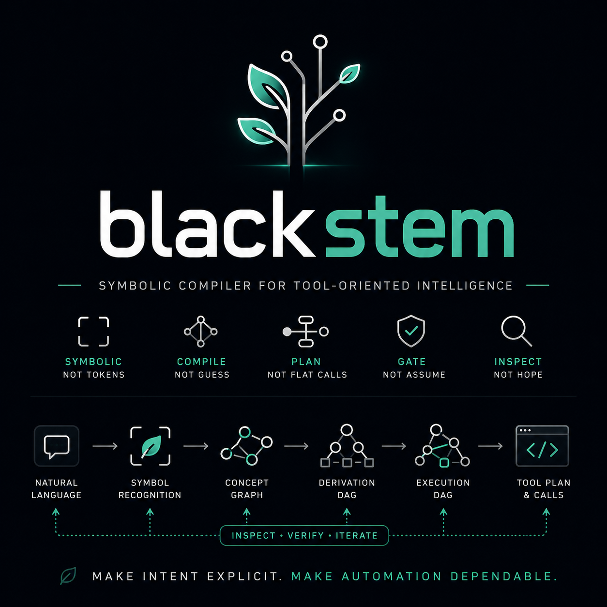
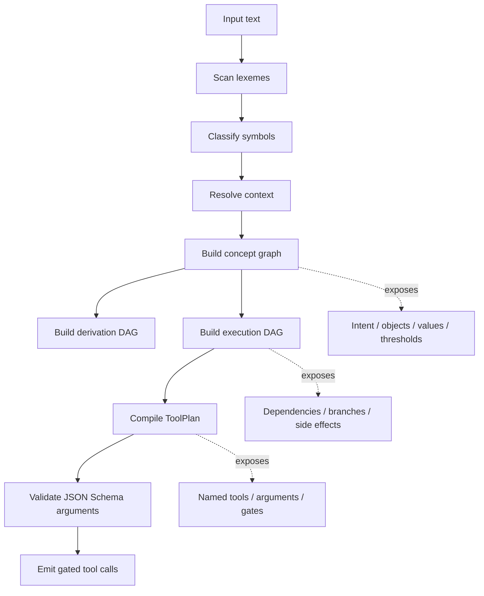
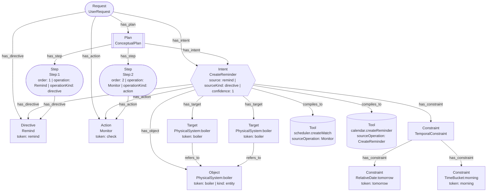
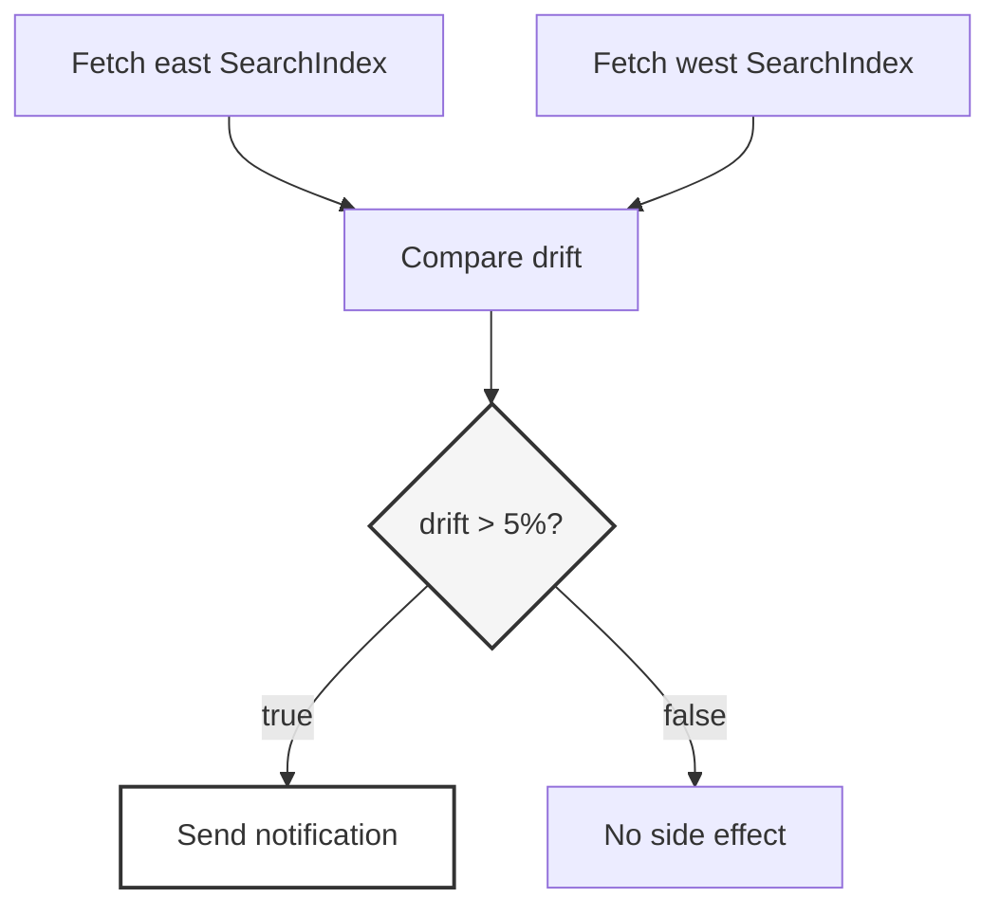

# blackstem

<p align="center">
  
</p>

`blackstem-js` is a small symbolic compiler for executable tool plans.

It explores how much of tool calling can be handled as an inspectable compiler
pipeline instead of a model guessing JSON. The prototype scans a request,
classifies symbols, builds graph structure, validates arguments, and emits a
tool plan with dependencies and gates.

[Try the demo](https://pjensen.github.io/blackstem/)

```txt
language in
tool plan out
```

## Why

Tool calls cross from language into action. At that boundary, the useful
questions are compiler questions:

```txt
What action is being requested?
What object is being acted on?
What condition controls the action?
What schema must the arguments satisfy?
What depends on what?
What is allowed to cause a side effect?
```

`blackstem-js` keeps those answers visible. The output is not a single guessed
function call; it is a plan that can include named tools, JSON Schema arguments,
dependencies, gates, thresholds, source objects, target objects, and downstream
side effects.

## Run Locally

The browser demo is static. Open `index.html`, or run the CLI examples with
Deno:

```sh
deno run run.js
```

## Pipeline



## Examples

### Generated concept graph

Input:

```txt
Remind me to check the boiler tomorrow morning.
```

One generated trace from the demo turns that request into this concept graph:



### Reminder with temporal normalization

Input:

```txt
Remind me to check the boiler tomorrow morning.
```

Recognized structure:

```txt
intent:
  CreateReminder

object:
  PhysicalSystem:boiler

temporal:
  RelativeDate:tomorrow
  TimeBucket:morning
```

Compiled plan:

```txt
NormalizeTemporalConstraint
  temporal:
    - RelativeDate:tomorrow
    - TimeBucket:morning

CreateReminder
  text: check boiler
  temporal: $NormalizeTemporalConstraint.output
```

The important part is that temporal interpretation is separated from reminder
creation.

### Compare, gate, notify

Input:

```txt
Compare the east and west search indexes and alert me if drift exceeds 5%.
```

This is not one function call. It is a graph:



Compiled shape:

```txt
FetchSubjectA
  subject: SearchIndex
  qualifier: Region:east

FetchSubjectB
  subject: SearchIndex
  qualifier: Region:west

Compare
  metric: Metric:drift

EvaluateCondition
  Metric:drift > 5%

Notify
  gatedBy: EvaluateCondition
```

Tool calling is not just choosing a function. It is preserving the shape of the
action.

### One condition, multiple side effects

Input:

```txt
If cost is over $250, notify me and build a report.
```

Compiled shape:

```txt
CreateWatch
  -> EvaluateCondition
    -> Notify
    -> BuildDocument
```

One condition can branch into multiple downstream side effects. Dependency order
is not permission, so side effects should carry explicit gate lineage:

```txt
condition -> side effect
```

should compile into:

```txt
dependsOn: condition
gatedBy: condition
```

## Current Status

This is a prototype and an argument, not a production library.

Known rough edges:

- the weather path still rejects the symbolic parse while still emitting a
  direct tool-plan override
- repeated temporal expressions such as "every morning" lose useful cadence
  detail
- qualifier binding is crude, for example `primary API latency`
- side-effect gate propagation should be stricter
- the vocabulary needs domain packs for tool surfaces such as weather,
  calendar, monitoring, documents, git, email, and finance

Near-term work:

- domain vocabulary packs
- stricter gate propagation
- better qualifier binding
- unified direct-tool and symbolic paths
- richer temporal normalization
- policy nodes
- plan validation passes
- graph export
- minimal runtime executor
- request-to-plan test corpus

## Non-goals

`blackstem-js` is not trying to be a chatbot, an agent framework, a general
natural language understanding system, or a replacement for all model-based
planning.

It is a control-plane experiment: use models where they help, but keep the
action boundary inspectable, boring, and governable.

## License

HSSL.
